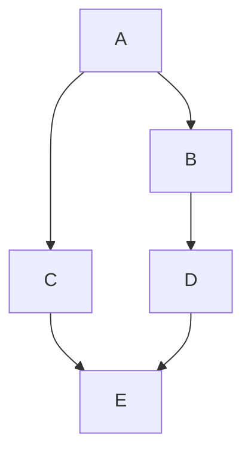

# Nomad Pipeline

Nomad is great for batch jobs, however in its current state, you can't have job dependecies which is required when running pipeline style workload. The inspiration for this project came from the [`nomad-dag-hack`](https://github.com/cgbaker/nomad-dag-hack) project and the accompanying [blog post](https://www.cgbaker.net/2020/12/hacking-nomad-job-dependencies/).


## How to get started?

It's just 2 steps...

**Inject the 'init' task group**

The 'init' task will look at all the meta-tags setup in the next step and inject lifecycle task hooks into the task groups. The hooks are responsible for starting the next task group after the current one finishes.

```hcl
variable "nomad_addr" {
  type    = string
}

job "example-job" {

  group "▶️" {
    count = 1

    task "init" {
      driver = "docker"

      config {
        image = "ghcr.io/hyperbadger/nomad-pipeline:main"
        args  = ["-init"]
      }

      env {
        NOMAD_ADDR = var.nomad_addr
      }
    }
  }

  ...
}
```

**Annotate task groups with meta-tags**

```hcl
job "example-job" {

  ...

  group "1-first-task-group" {
    count = 0  # <-- Important! nomad-pipeline will control the count

    meta = {
      "nomad-pipeline/root" = "true"  # <-- Indicates the starting task group
      "nomad-pipeline/next" = "2-second-task-group"
    }

    ...
  }

  group "2-second-task-group" {
    count = 0

    ...
  }

  ...
}

```

## How to run examples?

**Requirements**

- Docker (with default `bridge` network)
- Nomad
- jq

**Steps**

1. Find your Docker `bridge` network gateway IP - `export DOCKER_GATEWAY_IP=$(docker network inspect bridge | jq -r ".[].IPAM.Config[].Gateway")`
1. Start Nomad in dev mode - `nomad agent -dev -bind "${DOCKER_GATEWAY_IP}"`
1. Ensure Nomad has started by visiting `echo "http://${DOCKER_GATEWAY_IP}:4646"`
1. Set `NOMAD_ADDR` for the Nomad CLI to access Nomad - `export NOMAD_ADDR="http://${DOCKER_GATEWAY_IP}:4646"`
1. Ensure Nomad CLI works - `nomad server members`
1. Run any job in the examples/ directory - `nomad job run examples/happy-job.hcl`

## Other features

**Run tasks in parallel**

***Using dependencies***

To support running tasks in parallel and having a final task that runs at the end of all parallel tasks (eg. fan-out fan-in pattern), you can use the `nomad-pipeline/dependencies` tag.



In the above case, the E task should look like the following, this will ensure that C and D run before E runs, even if C and D finish at different times.

```hcl
group "E" {
  count = 0

  meta = {
    "nomad-pipeline/dependencies" = "C, D"
  }

  ...
}
```

See [`dependencies.hcl`](examples/dependencies.hcl) for a more complete example.

***Using count***

Another way to implement the fan-out fan-in pattern is to have multiple instances of a task group that can all pick up some work. Without nomad-pipeline, this is quite easy, you just set the [`count` stanza](https://www.nomadproject.io/docs/job-specification/group#count) on the task group. However, when using nomad-pipeline, the control of count is not in your hands. So if you want to set a count greater than 1, you can set the `nomad-pipeline/count` tag.

> 💡 *Tip: The [`count` stanza](https://www.nomadproject.io/docs/job-specification/group#count) doesn't support variable interpolation since the config value is an integer and not a string - currently Nomad only support variable interpolation for string config values. This means that `count` can't be set from a `NOMAD_META_` variable, which is required for setting the `count` dynamically in a parameterized job. Using the `nomad-pipeline/count` tag allows you work around this. All `nomad-pipeline/*` tags interpolates variables, so you can use something like `"nomad-pipeline/count" = "${NOMAD_META_count}"`*

See [`examples/fan-out-fan-in.hcl`](examples/fan-out-fan-in.hcl) for a more complete example.

**Dynamic tasks**

Dynamic tasks allows you to have a task that outputs more tasks 🤯. These tasks are then run as part of the job. This can open up the possibility to create some powerful pipelines. An example use case is for creating periodic splits of a longer task, if you have a task that processes 5 hours of some data, you could split the task into 5x 1 hour tasks and run them in parallel. This can be achieved by having an initial task that outputs the 5 split tasks as an output.

To use dynamic tasks, set the `nomad-pipeline/dynamic-tasks` tag to a path/glob of where the task JSON's will be outputted. This path should be relative to [`NOMAD_ALLOC_DIR`](https://www.nomadproject.io/docs/runtime/environment#alloc).

In the following example, the 1-generate-tasks first runs and outputs the 2-echo-hey task group which then gets launched after 1-generate-tasks finishes.

```hcl
group "1-generate-tasks" {
  count = 0

  meta = {
    "nomad-pipeline/root"          = "true"
    "nomad-pipeline/dynamic-tasks" = "tasks/*"
  }

  task "generate-tasks" {
    driver = "raw_exec"

    config {
      command  = "/bin/echo"
      args     = ["generated tasks"]
    }

    template {
      data = <<-EOT
      [{
        "Name": "2-echo-hey",
        "Count": 0,
        "Meta": {
          "nomad-pipeline/root": "true"
        },
        "Tasks": [{
          "Name": "echo",
          "Driver": "raw_exec",
          "Config": { "command": "/bin/echo", "args": [ "hey" ] }
        }]
      }]
      EOT

      destination = "${NOMAD_ALLOC_DIR}/tasks/echo_hey.json"
    }
  }

  ...
}
```

See [`dynamic-job.hcl`](examples/dynamic-job.hcl) for a more complete example.

**Job Level Leader**

Nomad currently allows you to set a [`leader`](https://www.nomadproject.io/docs/job-specification/task#leader) at the task level. This allows you to gracefully shutdown all other tasks in the group when the leader task exits.

Using the `nomad-pipeline/leader` tag, you can get the same functionality at the job level. You can set the tag on a task group, and when that task group completes, all other task groups will be gracefully shutdown.

```hcl
group "leader" {
  count = 0

  meta = {
    "nomad-pipeline/leader" = "true"
  }

  ...
}
```

See [`leader-task-group.hcl`](examples/leader-task-group.hcl) for a more complete example.

**URL Friendly Nomad Environment Variables**

There are many useful [Nomad environment variables](https://www.nomadproject.io/docs/runtime/interpolation#interpreted_env_vars) that can be used at runtime and in config fields that support variable interpolation. However, in some cases, some of these environment variables are not URL friendly - in the case of parameterized jobs, the dispatched job's ID (`NOMAD_JOB_ID`) and name (`NOMAD_JOB_NAME`) will have a `/` in them. URL friendly versions of these variables are required when using them in the [`service` stanza](https://www.nomadproject.io/docs/job-specification/service#name). To allow for this, a URL friendly version of the `NOMAD_JOB_ID` and `NOMAD_JOB_NAME` can be found under `NOMAD_META_JOB_ID_SLUG` and `NOMAD_META_JOB_ID_SLUG` - the inspiration for `_SLUG` came from [Gitlab predefined variables](https://docs.gitlab.com/ee/ci/variables/predefined_variables.html). These meta variables are injected at the job level by the init task of nomad-pipeline, making them available to all the task groups that come after it.

Although this feature was added specifically for use with the [`service` stanza](https://www.nomadproject.io/docs/job-specification/service#name), it could prove useful for other config fields. Note to developer: nomad-pipeline might not be the right vehicle for this feature, however the init task was a convenient place to put this functionality.
